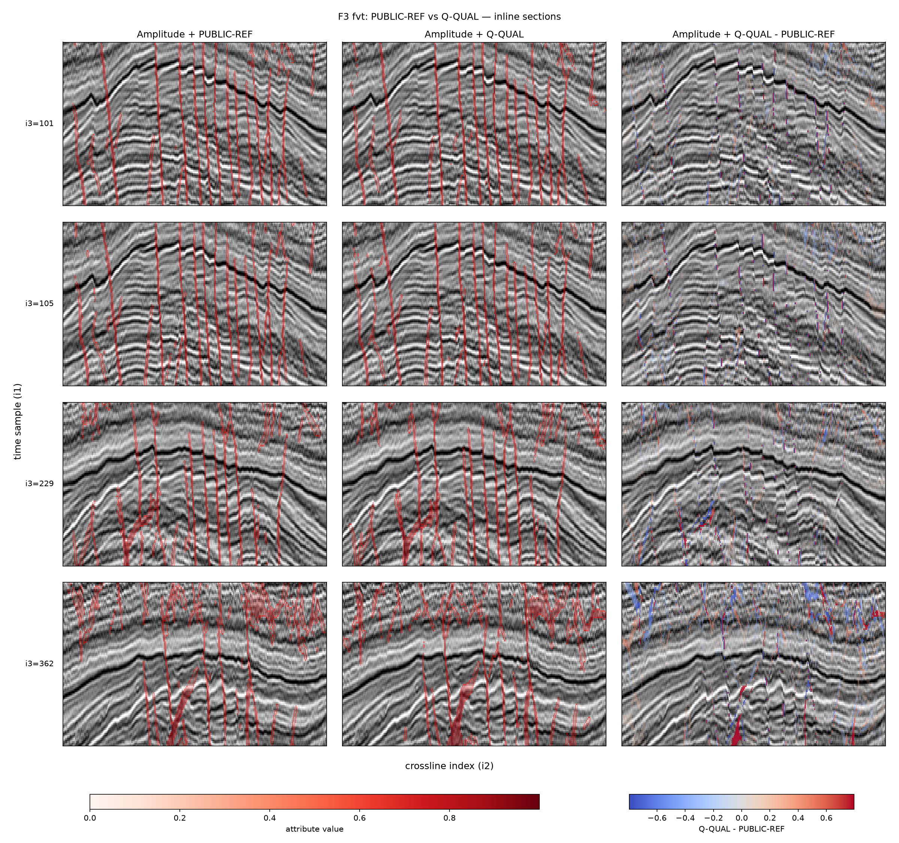
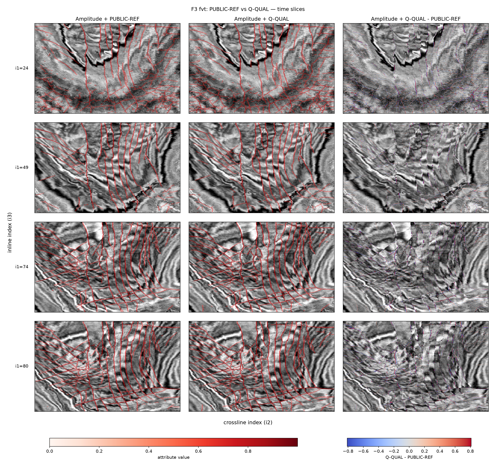

# PyOSV Q-QUAL PoC

PyOSV Q-QUAL PoC is a Python proof of concept for detecting and grouping
candidate faults from prepared 3-D seismic-derived attribute volumes.

It runs one fixed, reproducible Q-QUAL workflow and produces scanner
likelihood, voted likelihood, thinned fault ridges, and fault skins.

The optimal surface voting method was introduced by Xinming Wu and Sergey
Fomel. The upstream implementation used as the implementation reference is
[`xinwucwp/osv`](https://github.com/xinwucwp/osv).

The optimal surface voting method and its original implementation are upstream
work; PyOSV provides an independent Python reimplementation and
reproducibility-oriented packaging of the relevant 3-D workflow. It is not a
line-by-line port, is not bit-exact, and is not an API-compatible replacement
for the upstream Java/Jython code.



*F3 compact-publication example at the FVT stage, comparing PUBLIC-REF, the
Q-QUAL lineage, and their signed difference. PUBLIC-REF is an agreement target,
not geological truth.*



*F3 compact-publication FVT time-slice atlas at `i1` indices 24, 49, 74, and
80. From left to right: amplitude-backed PUBLIC-REF, amplitude-backed Q-QUAL,
and signed Q-QUAL minus PUBLIC-REF difference; x is crossline index `i2` and y
is inline index `i3`. PUBLIC-REF is an agreement target, not geological truth,
and the comparison does not establish geological accuracy.*

The canonical source repository is
<https://github.com/ozw4/pyosv-qqual-poc>.

## Scope

The distribution contains the Q-QUAL runtime, its required PyOSV dependency
closure, the compact-publication validator, examples, and focused tests. The
fixed runtime uses the quality scanner, quality voter thinning, and quality
skinning. The public CLI runs one fixed Q-QUAL configuration and does not
expose internal comparison modes. It does not include raw F3 DAT volumes, the
internal comparison runner, the full Synthetic evaluation, or the full
publication generator.

## Relationship to upstream OSV

Optimal Surface Voting is not an invention of PyOSV. The method is due to
Xinming Wu and Sergey Fomel, and the implementation reference for this project
is the upstream [`xinwucwp/osv`](https://github.com/xinwucwp/osv) repository.
PyOSV independently reimplements the relevant 3-D processing path in Python;
it does not claim line-by-line, bit-exact, or API compatibility with upstream.

PyOSV's contribution is the reproducibility-oriented Python PoC around that
processing path:

- a numerical implementation using NumPy, SciPy, and optional Numba;
- the fixed public Q-QUAL profile;
- an in-memory API and command-line interface;
- a hashed run-output contract;
- source and artifact provenance; and
- standalone compact-publication validation.

### Main differences

| Aspect | Upstream OSV | PyOSV Q-QUAL PoC |
| --- | --- | --- |
| Origin | Original optimal surface voting method and implementation | Independent Python reimplementation of the relevant 3-D processing |
| Runtime | Java/Jython research code built with Gradle and using Mines JTK | Python 3.10+, NumPy, SciPy, and optional Numba; no JVM, Jython, Mines JTK, or Gradle runtime dependency |
| Scope | Research-oriented 2-D and 3-D voting, scanning, thinning, and fault-surface workflows | One fixed public 3-D Q-QUAL workflow |
| Public configuration | Research programs and examples define their processing parameters | One fixed resolved profile; internal experimental and comparison modes are not part of the public runtime |
| Input | Inputs prepared by upstream research programs and examples | A prepared scanner-input attribute volume; the CLI does not convert raw seismic amplitude into scanner input |
| Outputs | Research voting maps and fault-surface products | `ft.dat`, `fv.dat`, `fvt.dat`, `skin_mask.dat`, `skins.json`, and `run.json` |
| Numerical equivalence | Implementation reference | Practical agreement contract; no bit-exact or API-compatibility claim |
| Reproducibility | Source and research examples | Fixed profile, source identity, artifact SHA-256 records, and a standalone publication validator |

### Algorithmic differences in the fixed F3 workflow

The detailed comparison below is between the checked-in upstream Java/Jython
F3 demo path in `demoF3d.py` and the fixed public Q-QUAL path. It is not a
catalogue of all upstream OSV features or API configurations. “Upstream F3
path” means that executable processing path in `xinwucwp/osv`; PUBLIC-REF is
instead the compact-publication agreement target.

PyOSV retains the broad optimal-surface-voting structure and its strike, dip,
and fault-normal conventions. The numerical kernels, some processing order,
and the Q-QUAL thinning and skinning policies are independently implemented.

#### Scanner and scanner thinning

| Stage | Upstream F3 path | Fixed PyOSV Q-QUAL path |
| --- | --- | --- |
| Scanner input | The F3 example computes an `ep` planarity attribute from seismic amplitude with `LocalOrientFilter(2,1,1)` and a zero mask before scanning. | Processing begins with a prepared scanner-input attribute volume such as `ep.dat`; amplitude-to-planarity conversion is outside the public runtime. |
| Core structure | For each strike, rotates the `(i2, i3)` plane around axis 1, smooths along strike, scans dip by shear–smooth–unshear, computes `1 - s^4`, maps results back, and retains maxima. | Retains those major operations and the likelihood formula, but changes part of their ordering and defines coordinate grids, array workspaces, kernels, and boundary values independently. |
| Orientation grid | Scans 18 strikes from 0° through 340° at 20° spacing and four dips from 65° through 80° at 5° spacing: 72 orientations. | Inserts interval midpoints with refinement factor 2: 35 strikes at 10° spacing and seven dips at 2.5° spacing, for 245 orientations. This denser grid is a search-policy difference, not a claim of greater geological accuracy. |
| Rotation and shear geometry | Rotation bounds follow transformed input corners. Dip shear expands its working axis by `int(abs(shear) * n1)` and unshear reduces it again. Rotated arrays may contain absent traces outside their support. | Rotation uses a radius-based odd rectangular grid. Dip shear keeps a same-shape slice and measures displacement about the axis-1 center. Outside samples are represented explicitly. |
| Interpolation and boundaries | Uses Mines JTK `SincInterpolator` with constant extrapolation and the upstream sinc-support boundary handling. | Uses SciPy first-order coordinate interpolation. Attribute-space rotation and shear fill outside values with `1.0`; likelihood unrotation fills them with `0.0`. |
| Oriented smoothing | Uses `RecursiveExponentialFilter` with zero-slope edges, width 8 along strike, and `8 * sin(theta)` along dip. | Uses `scipy.ndimage.gaussian_filter1d` with nearest-edge handling, width 8 along strike, and `8 * abs(sin(theta))` along dip. Equal nominal widths do not make the impulse or boundary responses identical. |
| Likelihood and winner selection | Computes `1 - s^4` without pre-clipping `s`, selects the best dip in rotated coordinates, unrotates the winning likelihood and dip volumes, clips likelihood, and then selects strike. | Clips `s` to `[0, 1]` before `1 - s^4`, unrotates every strike/dip candidate score, and then selects one discrete sampled orientation in the input grid. Interpolation and maximization therefore occur in a different order. |
| Scanner thinning | Applies recursive-Gaussian smoothing with sigma 1 in `i2` and `i3`, strict strike-binned nonmaximum suppression, and five-sample boundary cleanup using a 30° normal threshold. | Retains that suppression and cleanup structure with SciPy Gaussian smoothing and disjoint folded-strike bins. Nonretained strike and dip are `0`, rather than the upstream small negative sentinel; exact bin-boundary and edge responses can differ. |
| Degenerate input | The upstream scanner entry has no corresponding explicit finite-input or constant-volume result contract. | Rejects non-finite input and returns zero likelihood with the first sampled orientation for a constant volume. |

These scanner differences can change likelihood amplitudes, ridge locations,
selected angles, and responses near volume faces before voting begins.

#### Optimal-surface voting and FVT thinning

| Stage | Upstream F3 path | Fixed PyOSV Q-QUAL path |
| --- | --- | --- |
| Fixed controls | Uses `(ru, rv, rw) = (10, 20, 30)`, seed distance `d = 4`, seed threshold `fm = 0.3`, strain limits `0.25`, and surface-smoothing settings `(2, 2)`. | Pins the same headline controls and one attribute-smoothing pass. The public boundary policy uses rounded, clamped local-cost samples; support reweighting and final vote-map smoothing are disabled. |
| Seed selection | Selects `ft > fm` candidates in descending likelihood and greedily suppresses any later candidate within the radius-`d` index-space box. The source updates shared vote maps from a parallel seed loop without an explicit ordering contract. | Retains the strict threshold and box suppression, fixes equal-score order by descending C-order flat index, and accumulates the ordered seed sequence deterministically. |
| Local voting grid | Builds a local normal/dip/strike `(u, v, w)` grid around each seed, rounds and clamps global sample coordinates, and uses `1 - normalized_likelihood` as cost. | Retains that local-grid, lag, Java-style rounding, clamping, and cost structure in explicit float32 arrays. The core UVW evidence lookup is also nearest-sample, not interpolated. |
| Dynamic-programming surface | Uses nonlinear forward/reverse accumulation, strain-constrained backtracking with `bstrain = 4`, and recursive-exponential smoothing of the extracted surface. With the F3 setting 2, the recursive-filter parameter is `2 * bstrain = 8`. | Independently reimplements the same DP structure with Python and optional Numba kernels, but applies a SciPy Gaussian sigma of 2 directly to the extracted surface. The smoothing scale as well as the kernel differs. |
| Evidence and orientation filtering | Smooths input evidence with a Mines JTK recursive Gaussian at sigma 1. Surface orientation uses centered derivatives after recursive-Gaussian smoothing at `max(rv, rw) = 30`. | Uses nearest-edge SciPy Gaussian filters at sigma 1 and sigma 30 respectively, with explicit float32 validation and geometry guards. |
| Patch score and accumulation | Averages evidence on selected points whose axis-1 index is in range and whose `i2`/`i3` indices are off their volume faces, deposits that score on each accepted sample and a neighboring pair, and stores the strongest individual patch orientation. Concurrent additions and compare-then-write orientation updates have no explicit ordering guarantee. | Retains the same accepted-point predicate, patch-average, and neighbor-reinforcement rules, adds explicit support and bounds checks, and uses ordered accumulation. The fixed support settings do not reweight accepted patches. |
| Final normalization | Scales globally and applies `1 - (1 - x)^8` using repeated float multiplications. | Applies the same transform with NumPy, clipping and an explicit zero-range result. It adds no smoothing before the fixed transform. |
| Voter thinning (`fvt`) | Smooths in `i2` and `i3`, applies strict strike-binned nonmaximum suppression, and adds one-sided reinforcement for folded strike strictly between 60° and 120°. Inclusive sector boundaries can test either adjacent direction. | Uses the PyOSV-native `hybrid_v2` algorithm: a SciPy reference-like base with disjoint half-open strike bins, linearly interpolated fault-normal nonmaximum suppression where local strike/dip roughness exceeds 8°, and deterministic plateau recovery within two voxels of any of the six volume faces. The base writes smoothed `fv`; normal and plateau replacements retain original `fv`. Plateau tolerance is `1e-6`, and scanner-thinned likelihood supplied to voting breaks ties. There is no identical upstream stage. |

`OptimalPathPicker` is used by the upstream fault-skin growth code; it is not
the dynamic-programming surface extractor inside `OptimalSurfaceVoter`.
PyOSV does not present its voter DP as an `OptimalPathPicker` port.

#### Fault-skin construction

| Stage | Upstream F3 path | Fixed PyOSV Q-QUAL path |
| --- | --- | --- |
| Skinning inputs | Recomputes a separate planarity field from `fv` with `LocalOrientFilter(4,2,2)`, thins the voted likelihood with the upstream voter thinner, and supplies that planarity field to seed selection. | Uses `fvt` as the seed gate, voted strike/dip as geometry, and pre-thinning `fv` as the growth likelihood. It does not run `LocalOrientFilter` in the public workflow. |
| Seeds | Uses separation `d = 10`; both thinned likelihood and the separate planarity field must exceed `0.8`. | Uses separation `d = 1`; `fvt` must exceed `0.5`, while `fv` must exceed the 70th percentile of its positive samples, clipped to `[0.25, 0.75]`. Seed ordering and suppression are deterministic. |
| Growth and acceptance | Uses `ru = 150` and volume-spanning lateral radii, grows on `fv` with threshold `0.65`, and accepts skins larger than 200 cells. The F3 example then smooths each skin for five passes and keeps only skins whose maximum continuous `x1` coordinate exceeds 80. | Uses `ru = 10` and volume-spanning lateral radii, grows on `fv` at or above `0.5`, explores at most 10 rows per directional expansion, and accepts skins from one cell. It does not apply the five-pass smoothing or the `x1` cutoff. |
| Local path solver | Uses `OptimalPathPicker(4,0.3)` with `exp(-likelihood)` costs, gate- and anisotropy-aware transitions, and fractional parabolic path locations. | Uses an integer dynamic program with maximum jump 2, penalty 0.1, and deterministic center/lower-index tie rules. These paths are not sample-for-sample equivalents. |
| Orientation constraints | Samples strike along a candidate path, propagates parent dip during growth, and the F3 path leaves the default strike-change gate at 180°. | Samples strike and dip at each candidate and requires local-normal and world-axis-1 offsets no greater than 5 samples and circular strike change no greater than 30°. |
| Occupancy | Tests prior accepted cells in a radius-2 box only when folded strike differs by less than 40°. A separate radius-5 operation marks nearby seed objects after accepting a skin. | Rejects duplicate rounded world indices and orientation-independent occupancy collisions; accepted cells mark radius-1 boxes and seed/growth candidates query radius-2 boxes. |
| Reskinning | Can add missing local keys. It uses likelihood-squared weighted conjugate-gradient surface smoothing at `(4, 4)`, sigma-8 likelihood smoothing, strict gates of smoothed likelihood above `0.2` and normal offset below 5, and resamples `fv`. | The fixed `existing_cells_v1` policy never fills missing local keys. It projects and deduplicates observed cells, applies normalized linear-likelihood-weighted Gaussian smoothing at sigma 1, recomputes geometry and links for retained keys, and preserves their source likelihoods. |
| Empty-primary fallback | The upstream `FaultSkinner` path has no connected-component replacement for an empty result. | Only if primary skinning is empty while `fvt` contains values above `1e-6`, the fixed fallback returns 18-connected `fvt` components with the configured one-cell minimum. |
| Cell links and serialization | Mutable cells carry above/below/left/right links used for traversal, smoothing, and surface operations. | Primary reskinning rebuilds the four links in memory; fallback component cells do not populate them. `skins.json` serializes skin membership and cell attributes, not this link graph. |

Because differences occur before orientation selection, during surface
optimization, at final ridge selection, and while constructing skin topology,
matching output names do not imply matching arrays or cell graphs. Practical
agreement with PUBLIC-REF is the acceptance contract; neither implementation
is treated as geological truth.

### Upstream method

- Xinming Wu and Sergey Fomel, “Automatic fault interpretation with optimal
  surface voting,” *GEOPHYSICS* 83(5), O67–O82 (2018),
  [doi:10.1190/GEO2018-0115.1](https://doi.org/10.1190/GEO2018-0115.1).
- Upstream repository: [`xinwucwp/osv`](https://github.com/xinwucwp/osv).

## Installation

Python 3.10 or newer is required. From the repository root:

```bash
python -m venv .venv
. .venv/bin/activate
python -m pip install --upgrade pip
python -m pip install .
```

Optional Numba acceleration can be installed with `python -m pip install
".[accel]"`.

## Quick start with a prepared input

The CLI expects a prepared scanner-input attribute volume such as `ep.dat`. It
does not convert raw seismic amplitude into the scanner input.

For the F3 PoC data source, dataset identity, and attribution, see
[DATA_ATTRIBUTION.md](DATA_ATTRIBUTION.md). Raw F3 DAT volumes are not included
in this repository or its Release assets.

Prepare a regular, non-symlink, C-order DAT file containing big-endian float32
samples. Supply its shape in `(n3, n2, n1)` order and choose an output directory
that does not exist:

```bash
pyosv-qqual3d \
  --input /path/to/ep.dat \
  --shape 420,400,100 \
  --output-dir qqual-output \
  --pretty
```

For the F3 PoC files, `(n3, n2, n1)` maps to:

- `n3 = 420`: inline array indices
- `n2 = 400`: crossline array indices
- `n1 = 100`: time-sample array indices

`n1` is the fastest-varying C-order axis. These are array-index dimensions; the
package does not convert them to physical inline, crossline, or time
coordinates.

For other datasets, the physical meaning of each axis is defined by how the
input volume was prepared.

The command prints the new output directory after a successful atomic write.
The input file is not modified.

To validate an extracted compact publication:

```bash
pyosv-validate-compact /path/to/extracted/compact-publication
```

The [v0.1.0-poc Release](https://github.com/ozw4/pyosv-qqual-poc/releases/tag/v0.1.0-poc)
provides `pyosv-qqual-poc-v0.1.0-compact-publication.tar.gz` and its SHA-256
file. The archive is not part of the Git tree.

## Output bundle

The default Q-QUAL run writes:

- `run.json`: input identity, resolved fixed profile, software versions, and
  output size and SHA-256 records.
- `ft.dat`: quality-scanner fault likelihood.
- `fv.dat`: voted likelihood.
- `fvt.dat`: voter-thinned ridge volume.
- `skin_mask.dat`: mask of cells in the returned skins.
- `skins.json`: serialized fault-skin cells.

DAT outputs use big-endian float32 storage and the input shape. See the
[operation manual](docs/manual.md) for the complete file contract.

## Compact publication

The compact publication contains six atlases, their six machine-readable data
tables, a summary table, provenance, and a manifest. It reports agreement with
the F3 public reference; that reference is not geological truth. See
[PUBLIC-REF comparison and interpretation](docs/public_reference_comparison.md)
and [reproducibility boundaries](docs/reproducibility.md).

## Limitations

This is a proof of concept. Runtime and memory use scale with the input volume,
and results require domain interpretation. Only the fixed Q-QUAL workflow is a
public runtime. Users must supply input data they are authorized to use.

## License, attribution, and citation

The source code is provided under the Common Public License Version 1.0
(`CPL-1.0`); see [LICENSE](LICENSE). The CPL-1.0 license matches the upstream OSV
project whose processing structures informed and were adapted by PyOSV; see
[THIRD_PARTY_NOTICES.md](THIRD_PARTY_NOTICES.md). Data rights are addressed
separately in [DATA_ATTRIBUTION.md](DATA_ATTRIBUTION.md). Citation metadata is
available in [CITATION.cff](CITATION.cff).
